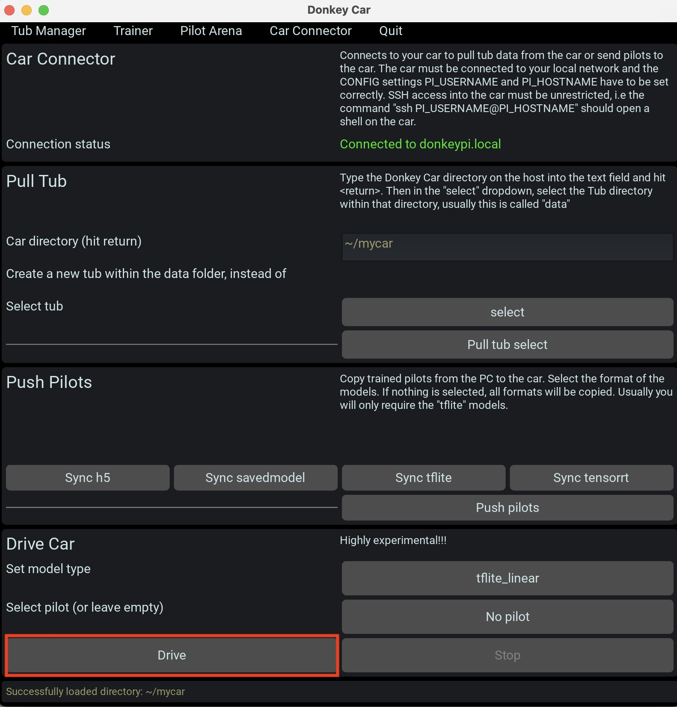
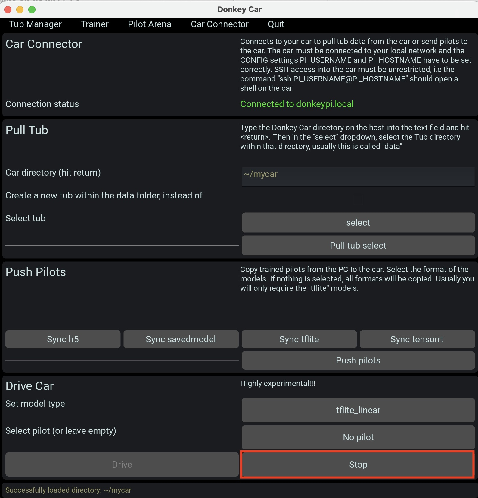

# データセットの収集

## Joystick F710

DonkeyCarの操作には、F710も使用します。

JoystickのモードがXになっている事を確認します。

キーアサインは以下の通りです。

## データセットの収集

それではデータセットを収集します。

まず、Joystickが省電力モードになっている場合があるので、復活させます。

Donkey UIからDriveを選択します。

画像の状態や走行状態をブラウザを起動して表示します。

Joystickを操作して、データセットを収集してください。なるべく均一の速度で、2000枚程度のデータを収集してください。データ収集が完了したら、Donkey UIのStopを押して、停止します。

