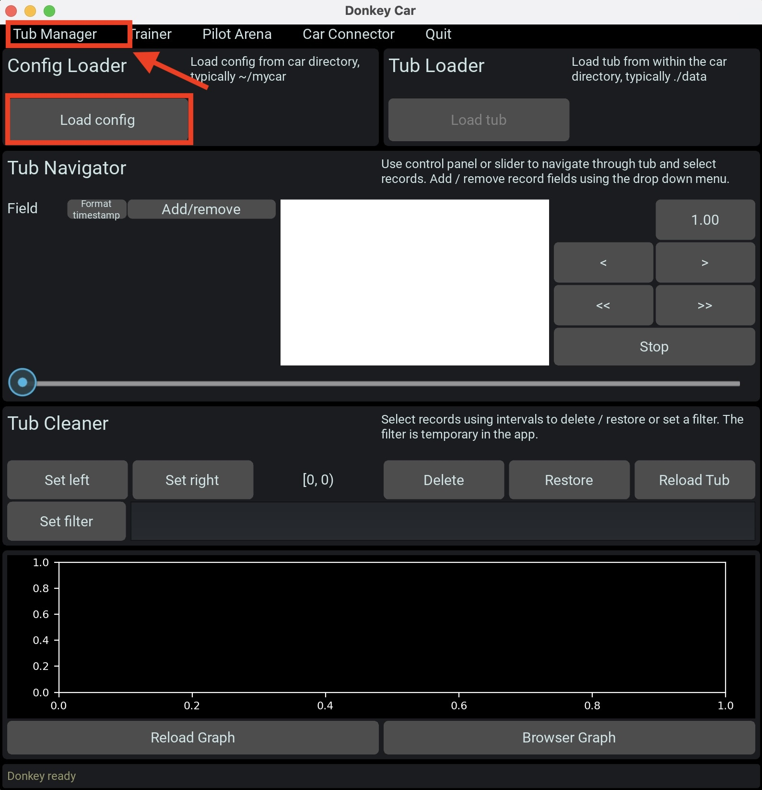
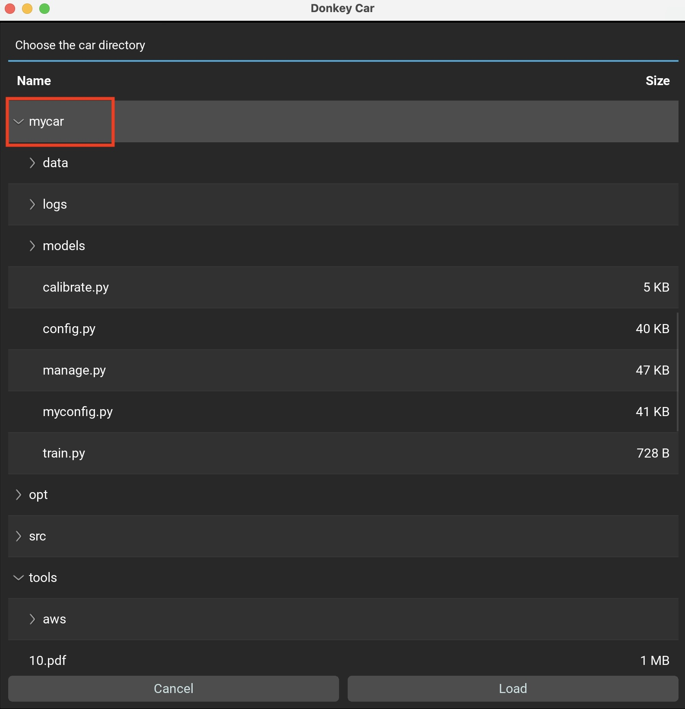
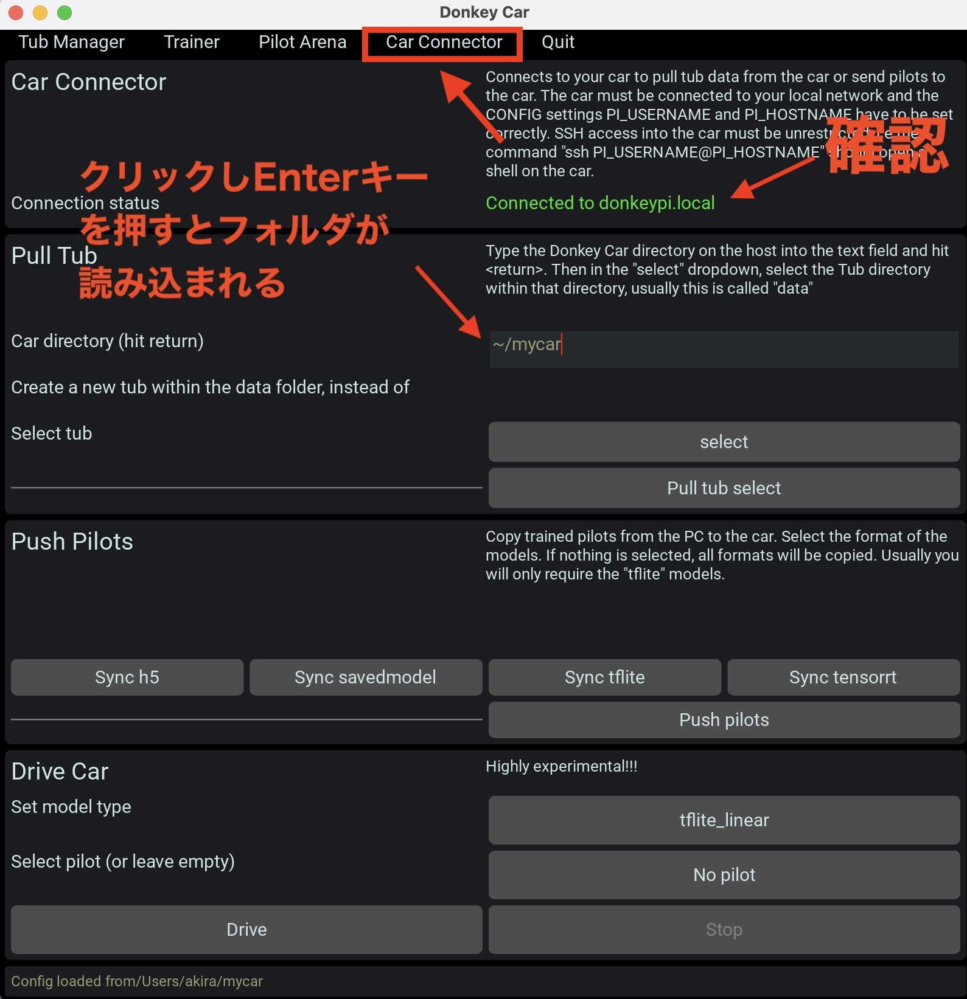
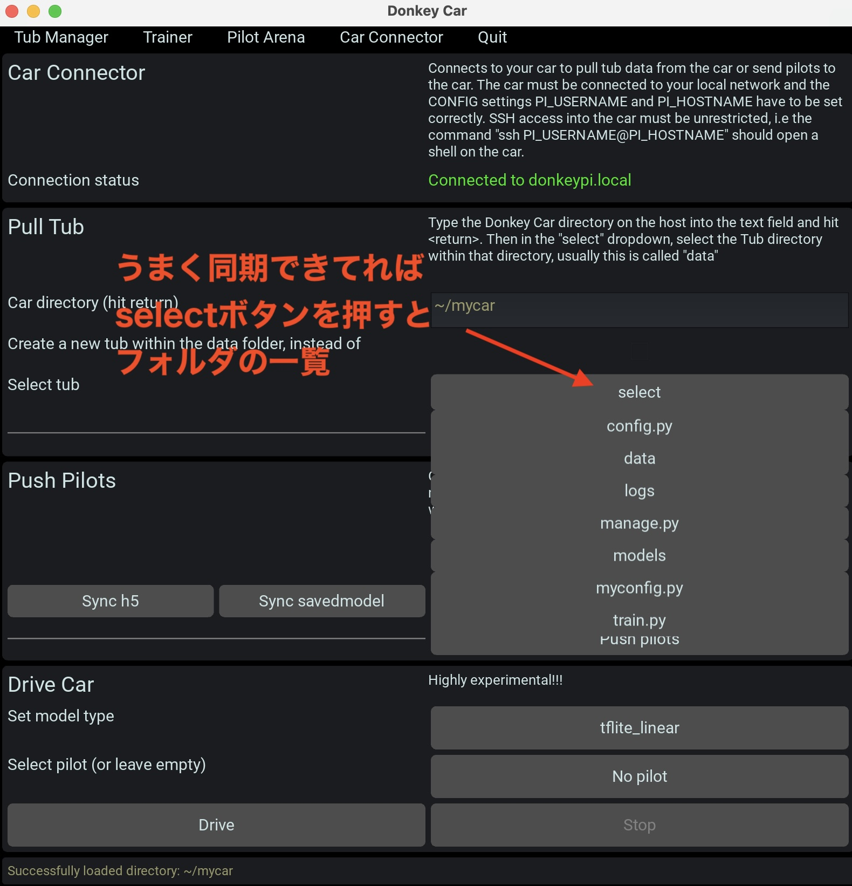
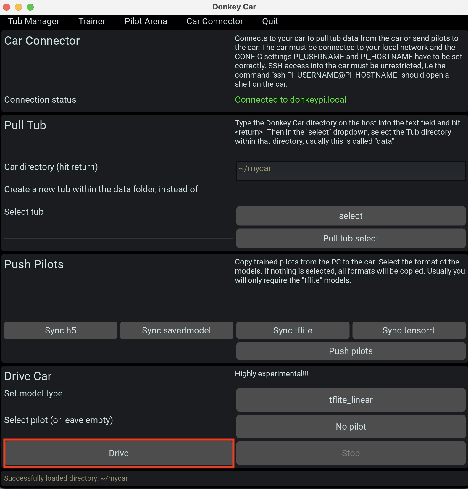
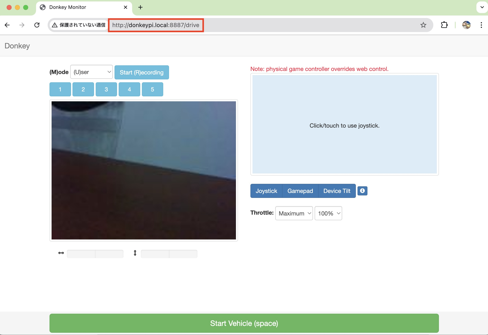
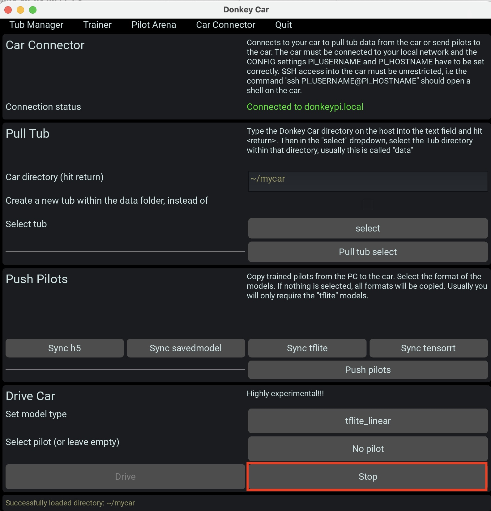

# PCのDonkeyUIの起動

## PCでDonkeyUIを起動

```
donkey ui
```

## プロジェクトフォルダの読み込み

~/mycar/のプロジェクトフォルダをDonkeyに取り込みます








## データ同期の確認





## DonkeyCarの起動を試してみる




DonkeyCarが起動すると、`http://donkeypi.local:8887` にブラウザで接続することで車載カメラなどが表示されます。




## DonkeyCarを停止する




!!!info
	DonkeyCarのraspberryPiに接続し<br>
	cd ~/mycar<br>
	python manage.py drive<br>
	を実行することで、手動でも同じ事をおこなう事も可能です。
