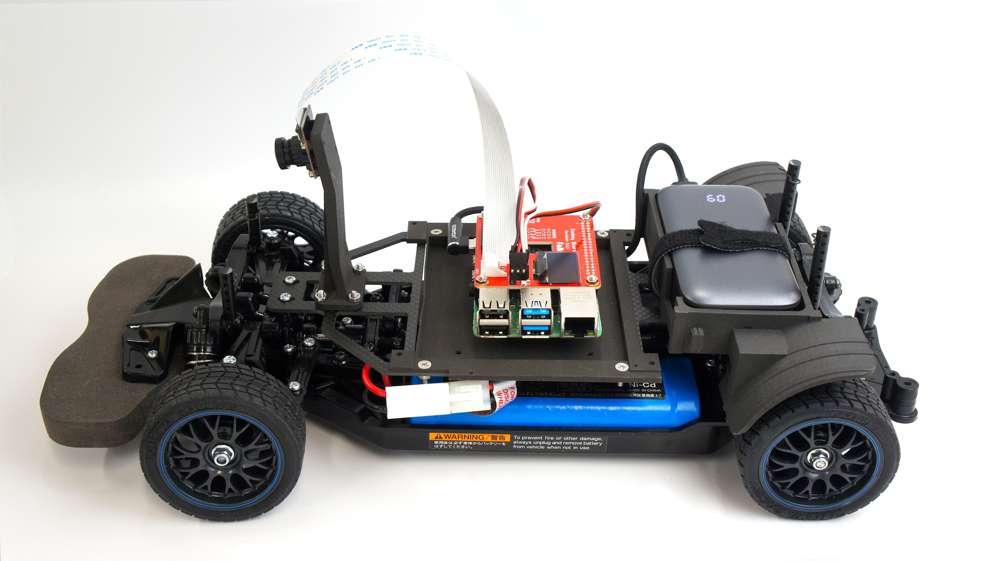
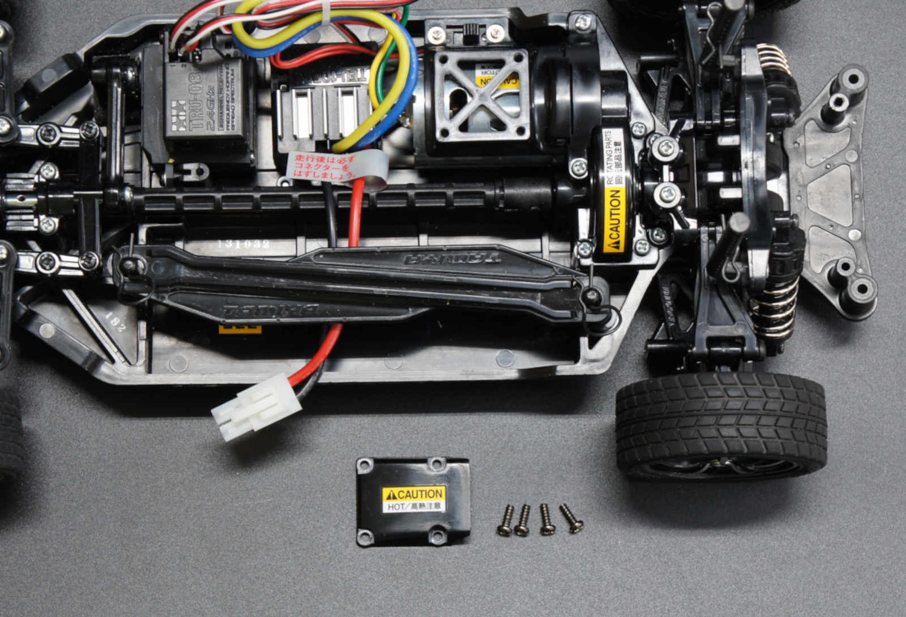
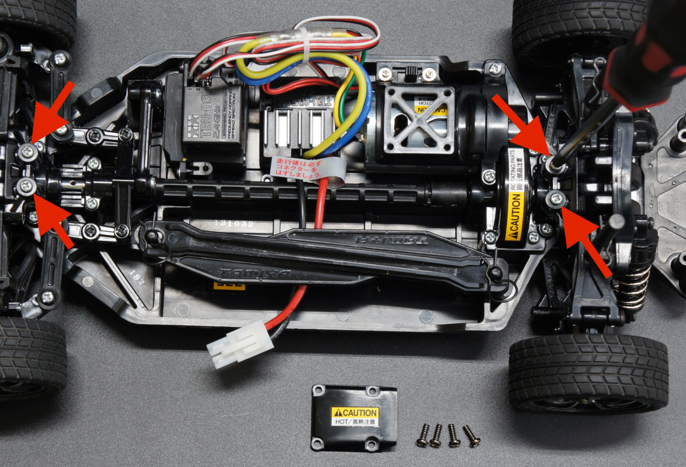
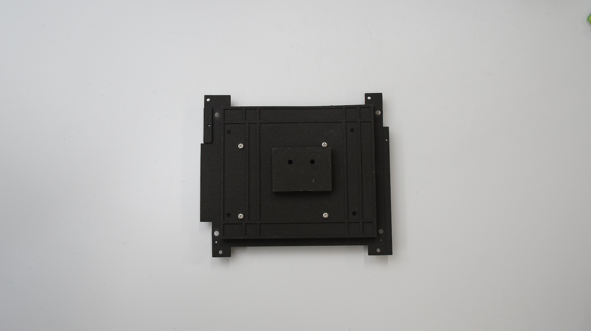
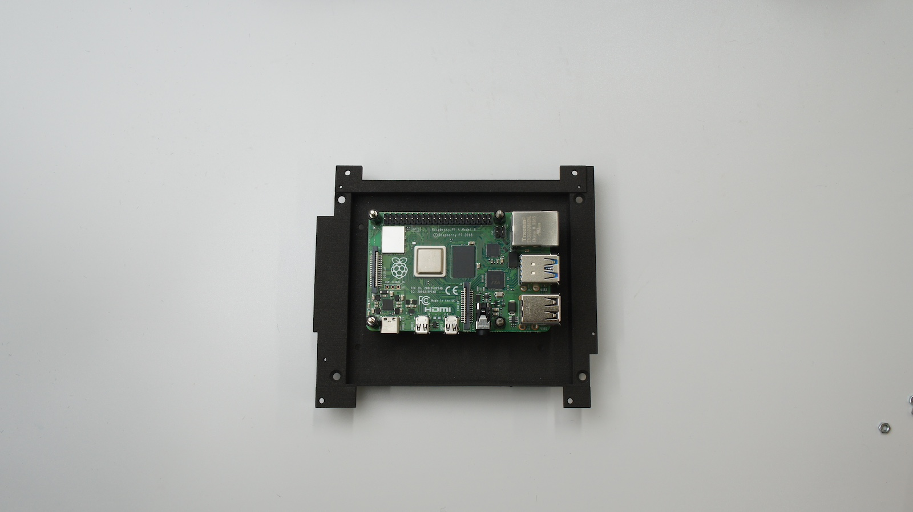
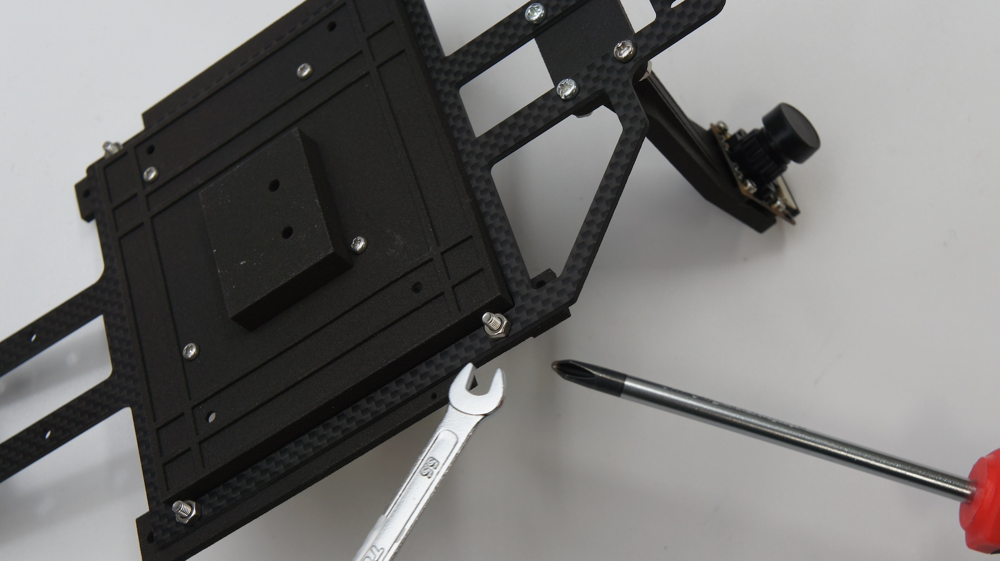
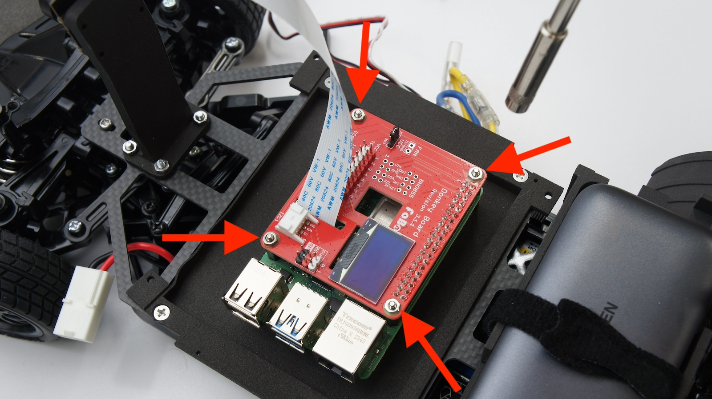
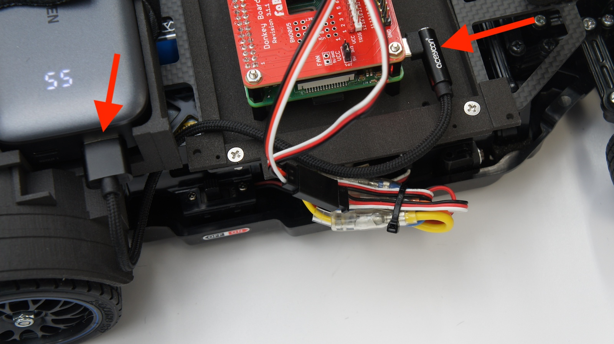
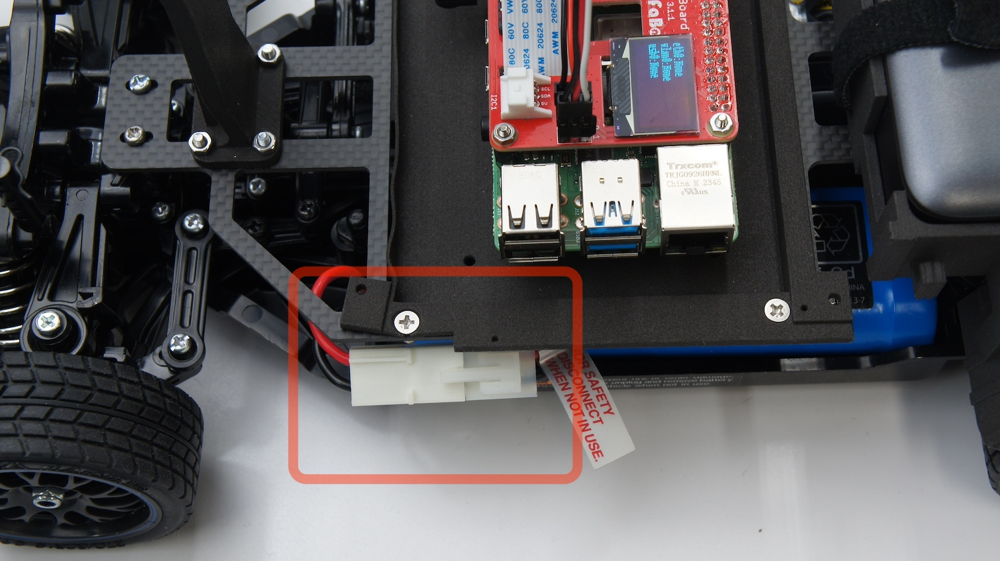

# FaBo AI Car Kitの組み立て

## 【対象モデル】

|コード番号|名称|TT-02 XB|Raspberry Pi|
|:--|:--|:--:|:--:|
|FA2025-B|FaBo AI Car Kit Basic Edition 通常版|◯|◯|
|FA2025-B-NV|FaBo AI Car Kit Basic Edition 車体なし|x|◯|
|FA2025-B-BB|FaBo AI Car Kit Basic Edition Rasberry Piなし|◯|×|

## RCカー(完成品)の改造

組み立て済みのRCカー本体を用意します。

モーターカバーのネジ4本を取り外し、モーターカバーを取り外します。

プラスドライバーでねじを外します。

カーバーを取ります。

矢印の箇所のネジ4本を取り外します。

矢印の取り外したねじは、このあとのカーボンパネル取り付けに使用します。

ケーブルを切断したり、傷つけないように注意し、ニッパーで矢印の結束バンドを切断します。

コネクタを受信機から取り外します。

RCカーのバッテリーフォルダは使いません。取り外してください。また、本モデルは受信機および送信機（プロポ）を使用しません。

## AI Car Kitの組み立て

CSIカメラをカメラマウントに取り付けます。

取り付けには六角棒レンチを使います。

カメラマウントをカーボンパネルに取り付けます。（なべネジM3*10）

カメラと反対側からなべねじを通して、カメラ側は、ナットでスパナ（5.5mm)等とプラスドライバーでねじ止めします。

mount_jetsonにラズパイを取り付けます。（なべネジM2.6*5）

表は、スペーサーを取り付けます。

裏は、なべねじで固定します。

ラズパイをスペーサーにて固定します。

固定された様子になります。

マイクロSDカードをラズパイのSDカードスロットに挿入します。

mount_jetsonとカーボンパネルを結合します。（皿ネジM3*10）

矢印の４箇所をねじ止めします。

スパナ(5.5mm)とドライバーでねじを締めます。

mount_backを取り付けします。（皿ネジM3*12）

プラスドライバーとスパナ等で締め付けします。

上部の部分は完成です。

矢印のコネクタを写真のようにRCカーのバッテリー側に寄せます。

前の章でRCカーから取り外したタッピングねじを使い。車体とカーボンパネルを連結します。（ラズパイバッテリー側）

同様に前の章でRCカーから取り外したタッピングねじを使い。車体とカーボンパネルを連結します。（カメラ側）

マジック結束バンドをmount_backにある穴に通します。

USBポートがある側を写真上側にして設置し、マジック結束バンドでモバイルバッテリーを固定します。

CSIカメラケーブルをCSIカメラと接続します。（コネクタは下接点）

拡張ボードにCSIカメラケーブルを通します。CSIケーブルの接点表裏にご注意願います。

ラズパイとCSIケーブルを接続します。

拡張ボードをナットで固定します。（M2.6ナット使用、ナットドライバー5mm 推奨,）

PWM延長ケーブルでESCのケーブルを延長します。

基板記載の０はESC、１はサーボに接続してください。（挿入方法、挿入向きは間違えないでください。）

結束バンドでケーブルを束ねます。結束バンドの余分な部分をニッパー等で切り落とします。

F710rを開封しアルカリ乾電池を取り付けて、F710r付属のUSBドングルをラズパイに挿入します。

USB電源ケーブルを取り付けます。

RCカー電源のコネクタを接続します。

RCカー電源のスイッチをON側にします。

最後にレンズキャップを外します。ピントがずれている場合は、レンズ部分を調整してピント調整してください。

破損を防ぐため、走行はボディを被せてください。（カメラマウントおよびカメラがボディを通るようにカッターナイフ等で穴を開けてください。）

使用しないときは、RCカーのコネクタを外しましょう。

