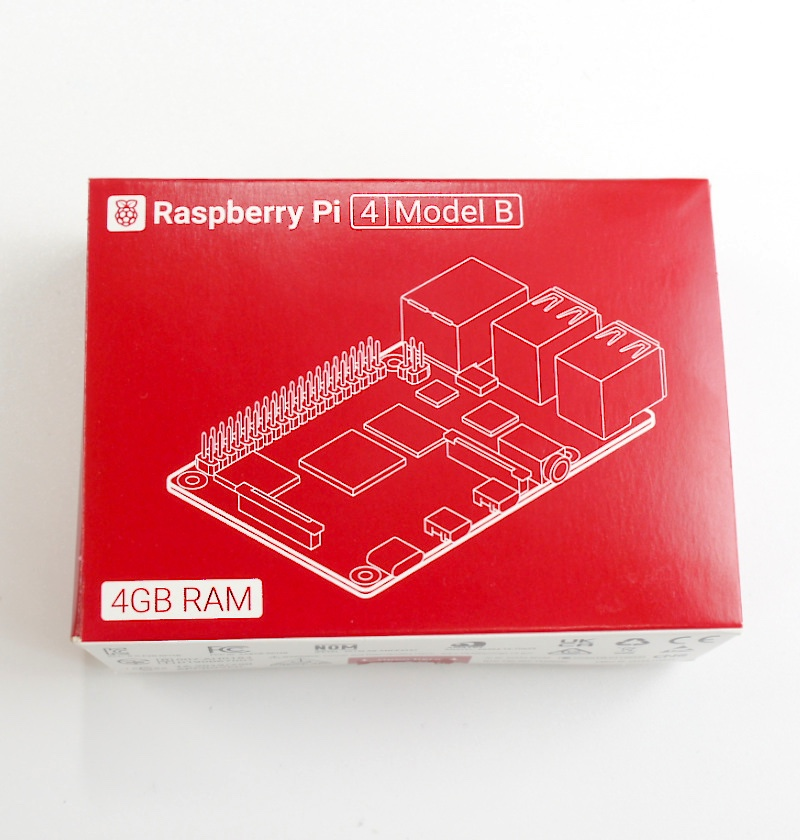

# FaBo AI Car KitのBOM（部品表）

## 【対象モデル】

|コード番号|名称|TT-02 XB|Raspberry Pi|
|:--|:--|:--:|:--:|
|FA2025-B|FaBo AI Car Kit Basic Edition 通常版|◯|◯|
|FA2025-B-NV|FaBo AI Car Kit Basic Edition 車体なし|x|◯|
|FA2025-B-BB|FaBo AI Car Kit Basic Edition Rasberry Piなし|◯|×|

## 【FaBo AI Car Kitの内容物】

|コード番号|写真|部品|個数|
|:--|:--|:--|:--|
|FA001||RCカー本体　タミヤ　TT-02 XBプロ エキスパートビルド ※完成品  ※タミヤ　1/10RC XB トヨタ　GRスープラ (TT-02シャーシ)  レッド タミヤ　1/10RC XB トヨタ GR 86 (TT-02シャーシ) ホワイト タミヤ　1/10RC XB トヨタ GR 86 (TT-02シャーシ) レッド タミヤ　1/10RC XB SUBARU BRZ(ZD8) (TT-02シャーシ) タミヤ　1/10RC XB トヨタガズーレーシングWRT/ヤリス　WRC（TT-02シャーシ） タミヤ　1/10RC XB NSX（TT-02シャーシ） タミヤ　1/10RC XB マツダ MAZDA3 (TT-02シャーシ) のいずれかになります。  ※車種は選べません。 ※FA2025-B-NVモデルは付属しません。 ※走行は、破損防止のためボディを装着してください。 ※写真はGRスープラの場合|１セット|
|FA101||base  ※カーボンファイバー製|1枚|
|FA201||mount_back  ※3DPrint|1個|
|FA202||mount_jetson  ※3DPrint|1個|
|FA203||mount_camera  ※3DPrint|1個|
|FA301||AI Board  ※FaBo 608 Rev 3.1.1|1枚|
|FA302||Raspberry Pi 4 Model B 4GB RAM  ※FA2025-B-BBは付属しません。|1台|
|FA401||モバイルバッテリー　UGREEN 25185|1台|
|FA402||マイクロSDカード128GB SanDisk  ※ケース付き|1枚|
|FA403||ジョイスティク F710r  ※ワイヤレス|1台|
|FA404||CSIケーブル ※２００ミリ 15pin|1本|
|FA405||CSIカメラ  ※IMX219|1個|
|FA406||電源USBケーブル|1本|
|FA407||PWMケーブル延長 ※オスーメス|1本|
|FA408||PWMケーブル ※オスーオス|３本|
|FA501||皿ねじ M3x12・・・・4本 M3ナット・・・・4個|１セット|
|FA502||皿ねじ M3x10・・・・4本 M3ナット・・・・4個|１セット|
|FA503||なべ　M3x10 ・・・・4本 M3ナット・・・・4個|１セット|
|FA504||タッピングM2x6 (六角)・・・・4本|１セット|
|FA505||六角オネジ・メネジ MB26-11・・・・8本 なべねじ　M2.6x5・・・・4本 M2.6ナット・・・・4個|１セット|
|FA601||結束バンド・・・・2本|１セット|
|FA602||結束マジックテープ|１本|

※5.5mmのスパナ、ドライバー、カッターナイフ、ニッパー、六角レンチ等が必要となります。お客様でご準備お願いいたします。 ※モバイルバッテリーの充電にはUSBタイプＣのケーブルと充電器が必要でございます。お客様でご準備ください。 ※開封後はすぐ欠品がないかご確認お願いいたします。もし欠品がございましたら、<a href="https://www.fabo.io/p/blog-page.html">こちら</a>までご連絡ください。
<a href="https://www.fabo.io/p/blog-page.html">https://www.fabo.io/p/blog-page.html</a>

