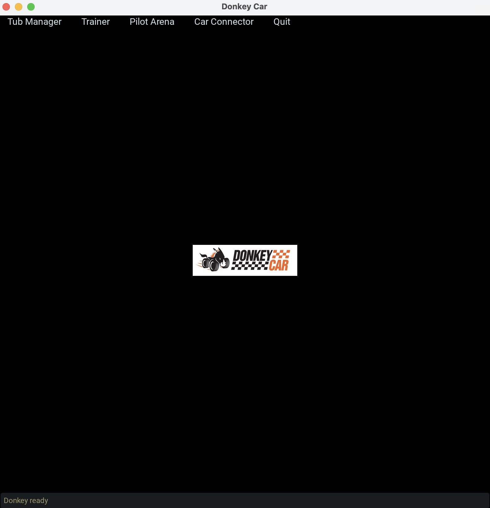

# Mac(Appleシリコン)

DonkeyCar Version 5.2.Dev2のMac(Appleシリコン,Mシリーズ)での構築方法です。

## Miniconda環境の構築

```
wget https://repo.anaconda.com/miniconda/Miniconda3-latest-MacOSX-arm64.sh
chmod 755 Miniconda3-latest-MacOSX-arm64.sh
./Miniconda3-latest-MacOSX-arm64.sh
```

## DonkeyCar環境の構築

```
conda create -n donkey520 python=3.11
conda activate donkey520
```
```
git clone https://github.com/autorope/donkeycar
cd donkeycar
git checkout 5483490
pip install -e .\[macos\]
```

!!!info
	Version 5.1.0ではうまく動かないようなので、最新の5.2.Dev2を使用します。


## DonkeyUIの起動テスト

```
donkey ui
```



