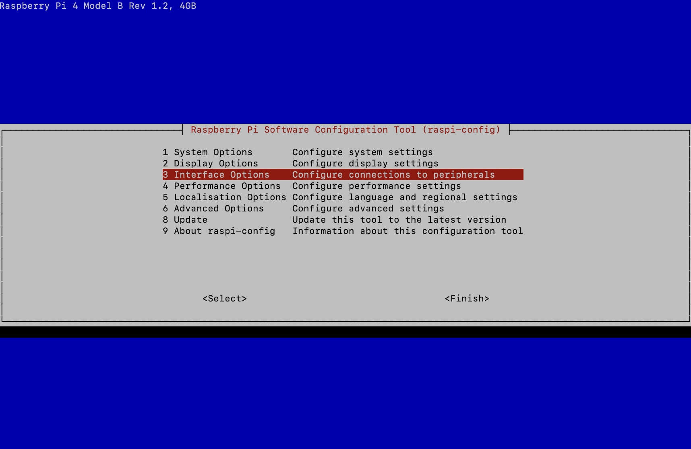
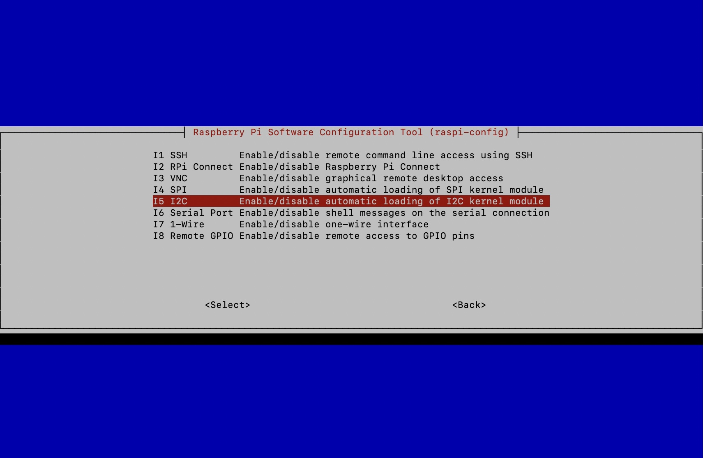
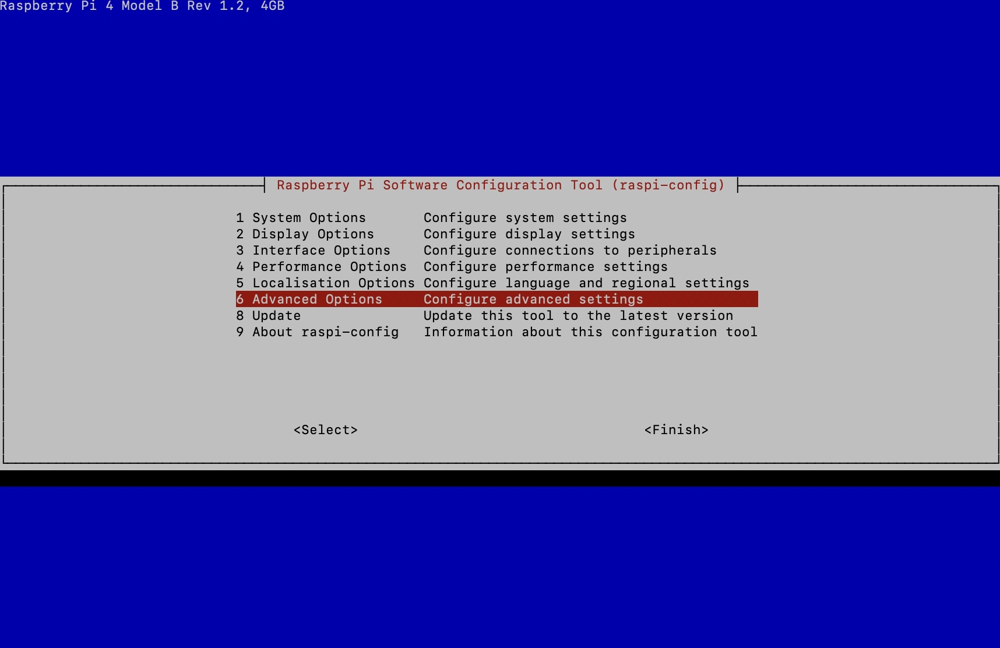
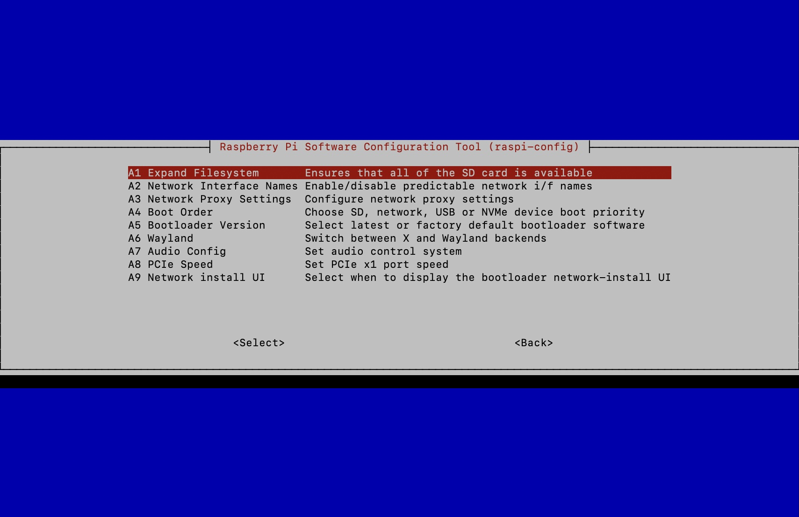

# Pi SDカード作成

## SSHでDonkeyCarに接続

```
ssh pi@donkeypi.local
```

```
The authenticity of host 'donkeypi.local (192.168.10.129)' can't be established.
ED25519 key fingerprint is SHA256:#############################
This key is not known by any other names.
Are you sure you want to continue connecting (yes/no/[fingerprint])? yes
Warning: Permanently added 'donkeypi.local' (ED25519) to the list of known hosts.
pi@donkeypi.local's password: 
Linux donkeypi 6.6.51+rpt-rpi-v8 #1 SMP PREEMPT Debian 1:6.6.51-1+rpt3 (2024-10-08) aarch64

The programs included with the Debian GNU/Linux system are free software;
the exact distribution terms for each program are described in the
individual files in /usr/share/doc/*/copyright.

Debian GNU/Linux comes with ABSOLUTELY NO WARRANTY, to the extent
permitted by applicable law.
Last login: Tue Nov 19 22:44:33 2024

SSH is enabled and the default password for the 'pi' user has not been changed.
This is a security risk - please login as the 'pi' user and type 'passwd' to set a new password.
```


## アップデートとアップグレード

```
sudo apt-get update --allow-releaseinfo-change
sudo apt-get upgrade
```

## I2Cを有効に

```
sudo raspi-config
```






## ファイルシステムの拡張






## カメラの認識

`/boot/firmware/config.txt` の`camera_auto_detect=1` の下に`dtoverlay=imx219`を追加します。

```txt hl_lines="3"
# Automatically load overlays for detected cameras
camera_auto_detect=1
dtoverlay=imx219
```

## 仮想環境を構築

```
python3 -m venv env --system-site-packages
echo "source ~/env/bin/activate" >> ~/.bashrc
source ~/.bashrc
```

```
sudo apt install libcap-dev libhdf5-dev libhdf5-serial-dev
```

## DonkeyCarの構築

```
cd ~/
git clone https://github.com/autorope/donkeycar
cd donkeycar
git checkout 5483490
pip install -e .[pi]
```

!!!info
	Ver 5.1.0ではうまく動かないようなので、最新の5.2.Dev2を使用します。

## OLED Display

```
cd ~/
git clone https://github.com/FaBoPlatform/ip_address_display
mkdir -p ~/fabo/bin
cd ip_address_display
cp oled_ip* ~/fabo/bin
```

```
pip install Adafruit_SSD1306
```

`/etc/systemd/system/ip_status.service`

```
[Unit]
Description=ip_stats

[Service]
Type=simple
User=pi
WorkingDirectory=/home/pi
ExecStart=/home/pi/env/bin/python /home/pi/fabo/bin/oled_ip.py
Restart=always
RestartSec=10

[Install]
WantedBy=multi-user.target
```

```
sudo systemctl daemon-reload
sudo systemctl enable ip_status.service
sudo systemctl start ip_status.service
sudo systemctl status ip_status.service
```

