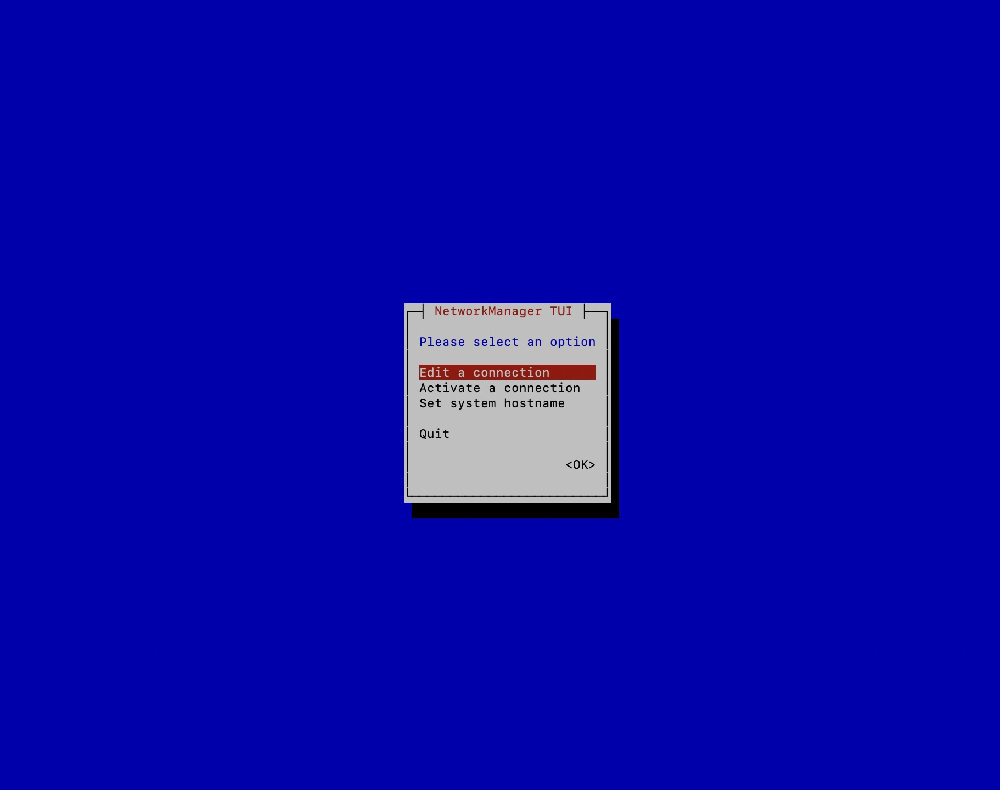
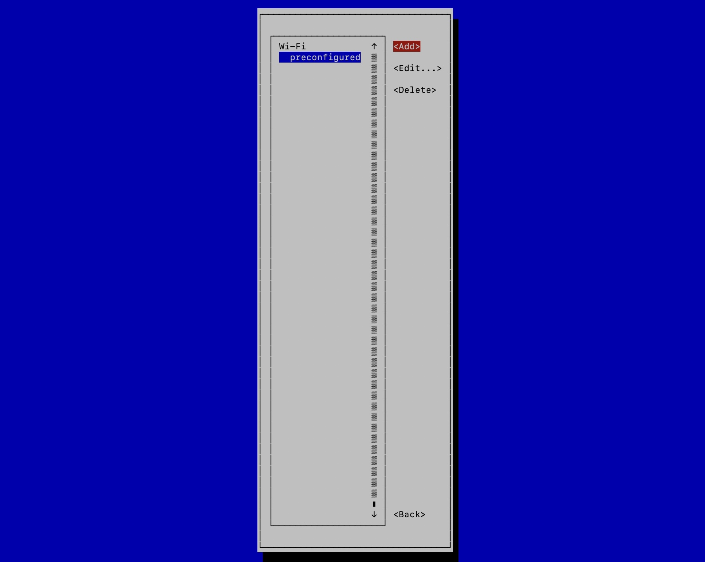
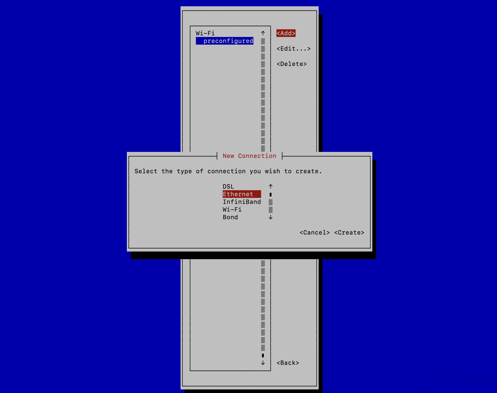
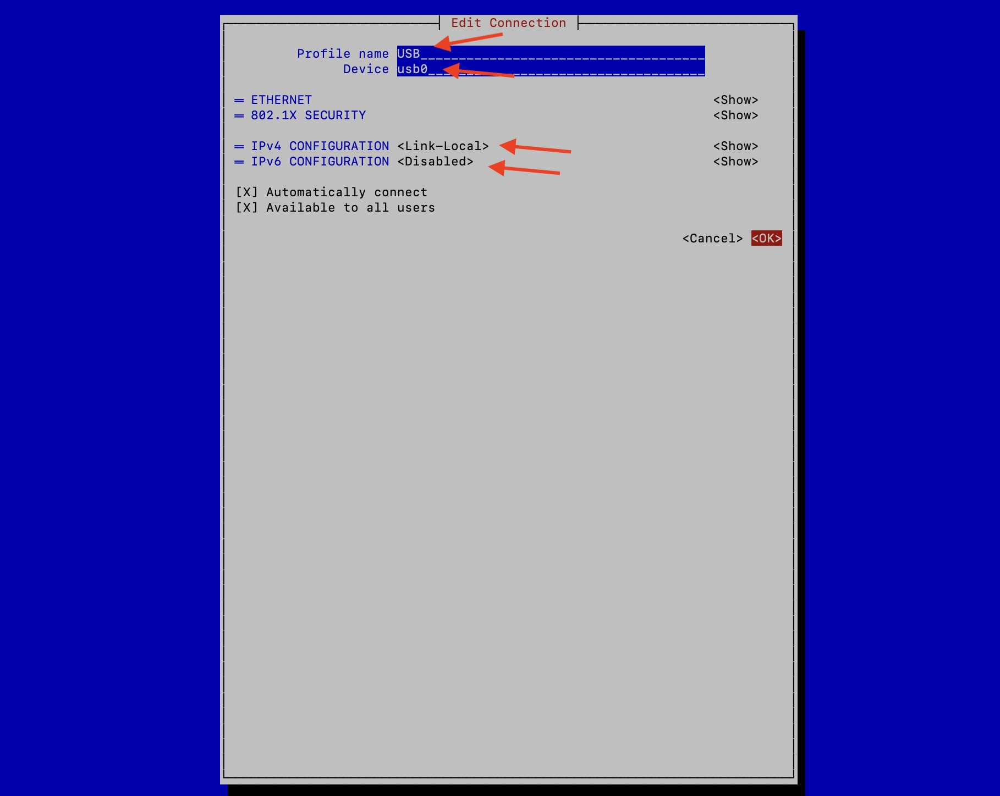

# Pi OTG設定

Qiitaの[Debian 12 (bookworm) ベースのRaspberry Pi OSでUSB-OTGする方法](https://qiita.com/JyJyJcr/items/f6a9c8f1e6599878bba0)記事を参考にさせてもらいました。

USB Type-CとPCを直接つなぐことで、OTGでRaspberryPiにアクセスできるようにしておきます。

## config.txt


`/boot/firmware/config.txt`


```
[all]
dtoverlay=dwc2
```

## cmdline.txt

`/boot/firmware/cmdline.txt`

rootwaitとquietの間に`modules-load=dwc2,g_ether`を追加

```
rootwait modules-load=dwc2,g_ether quiet
```

```
reboot
```

## mtui

```
sudo nmtui
```










```
sudo nmcli con mod USB-OTG connection.autoconnect-priority 0
```


## Rulesの更新

```
udevadm info /sys/class/net/usb0
```

で表示される`ID_PATH`の値をメモ

`/etc/udev/rules.d/85-usb-otg.rules`

```
SUBSYSTEM=="net", ACTION=="add|change|move", ENV{DEVTYPE}=="gadget",ENV{ID_PATH}=="メモしたIP_PATHの値", ENV{NM_UNMANAGED}=""
```


