# Pi SDカード作成

RaspberryPi4にDonkeyCar version 5.2.Dev2の環境を構築します。

## SDカードの作成

Raspberry Pi Imagerを用いてSDカードを作成します。

[https://www.raspberrypi.com/software/](https://www.raspberrypi.com/software/)

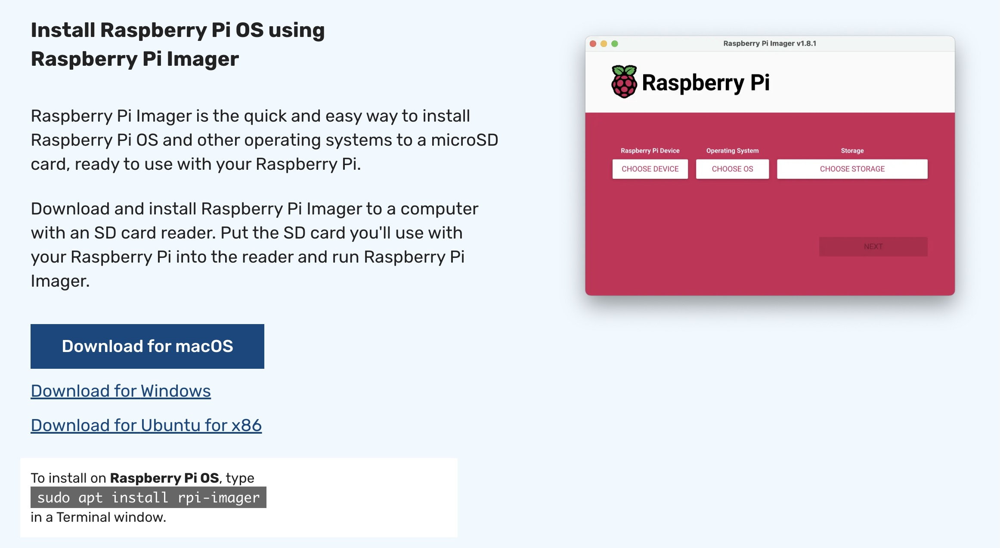

## Raspberry Pi Imager

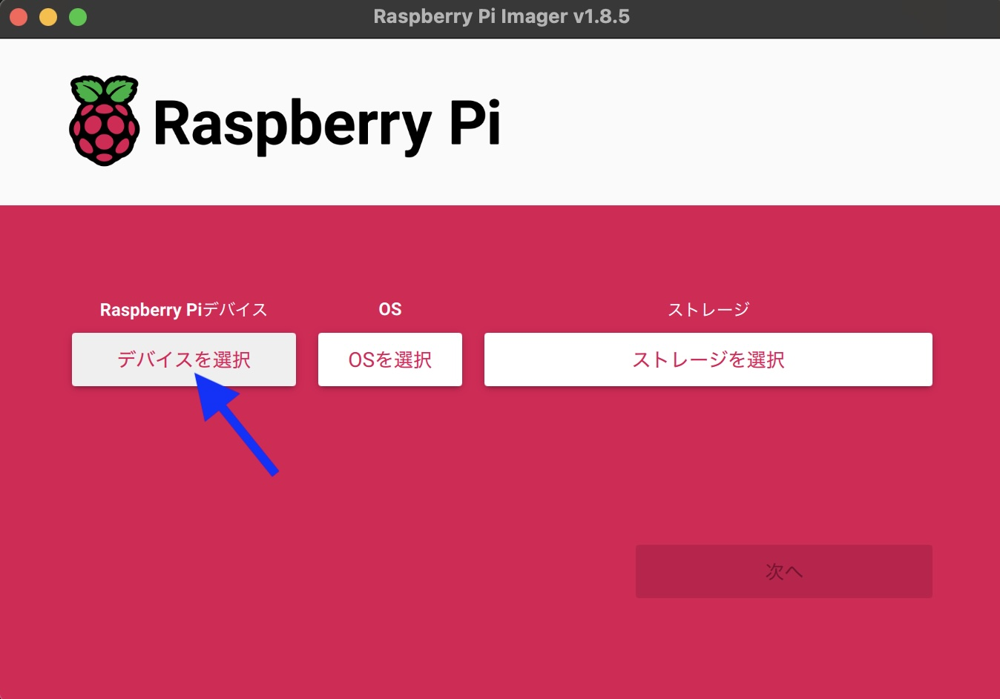

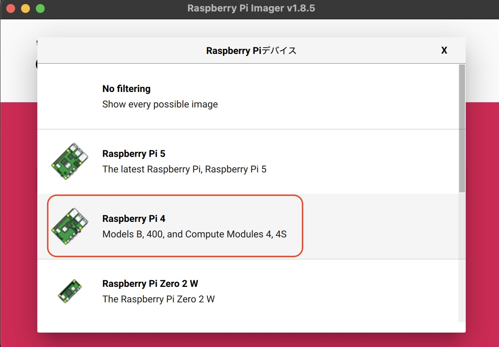

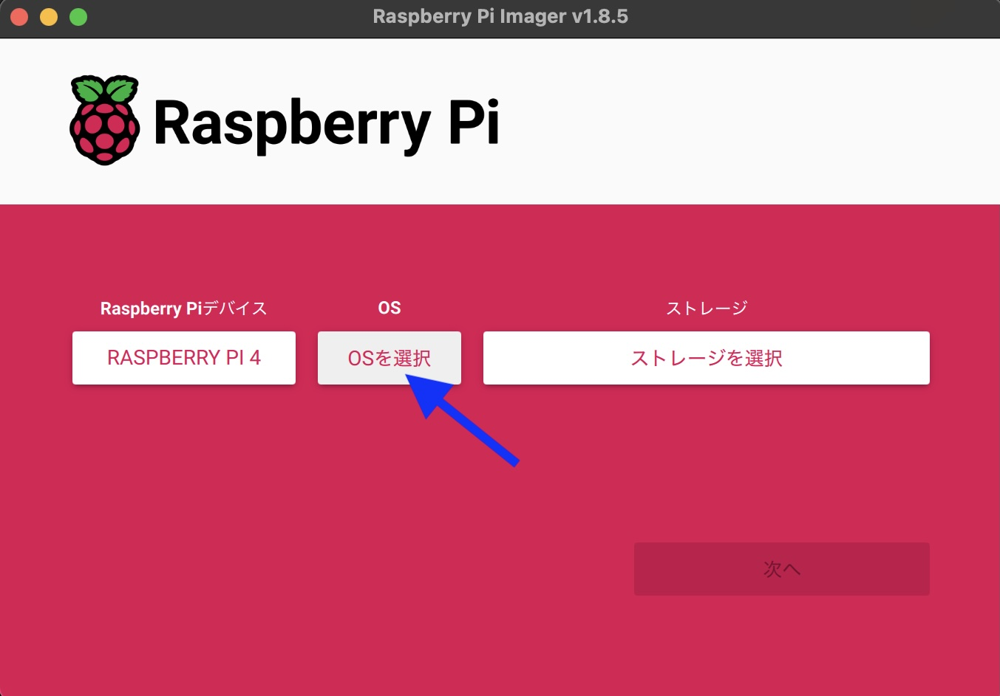

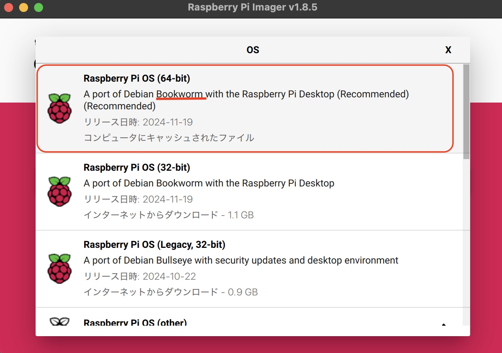

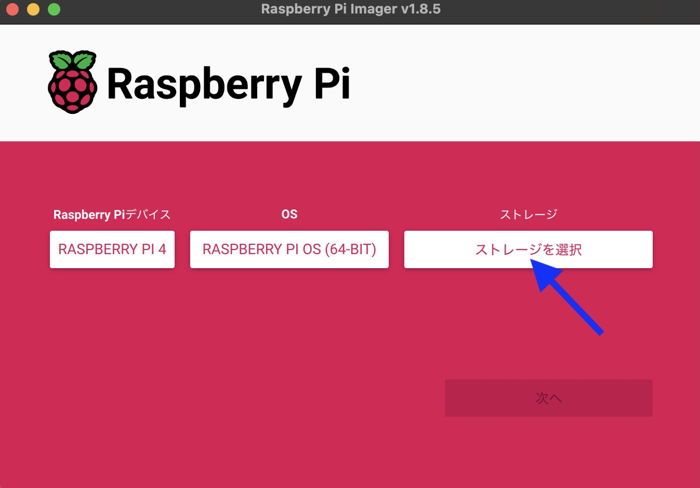

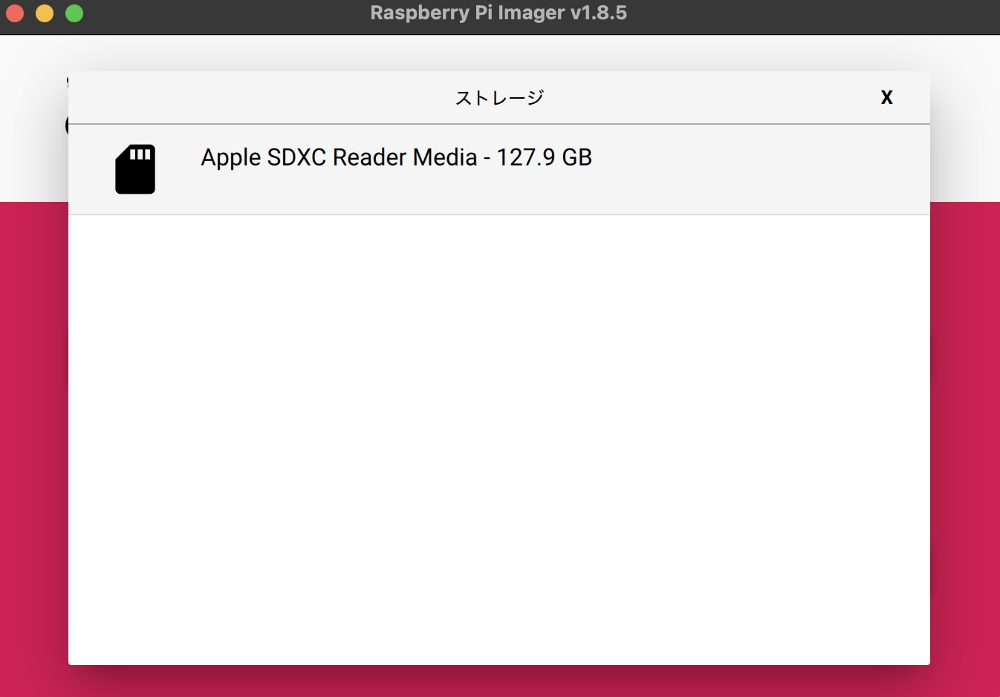

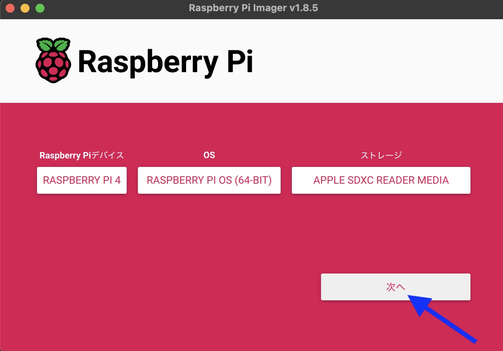

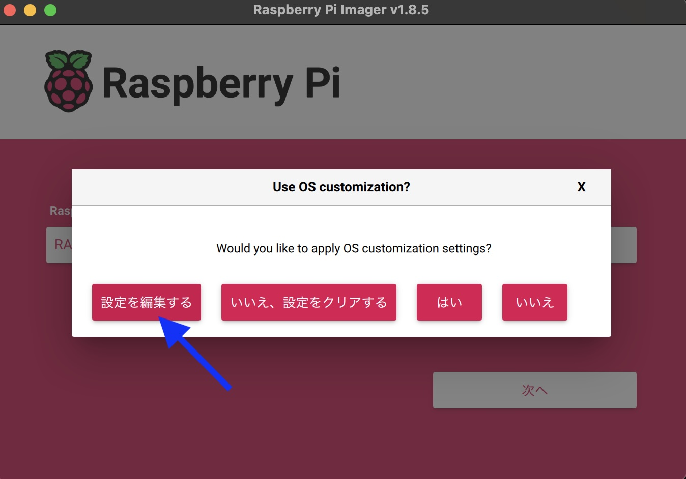

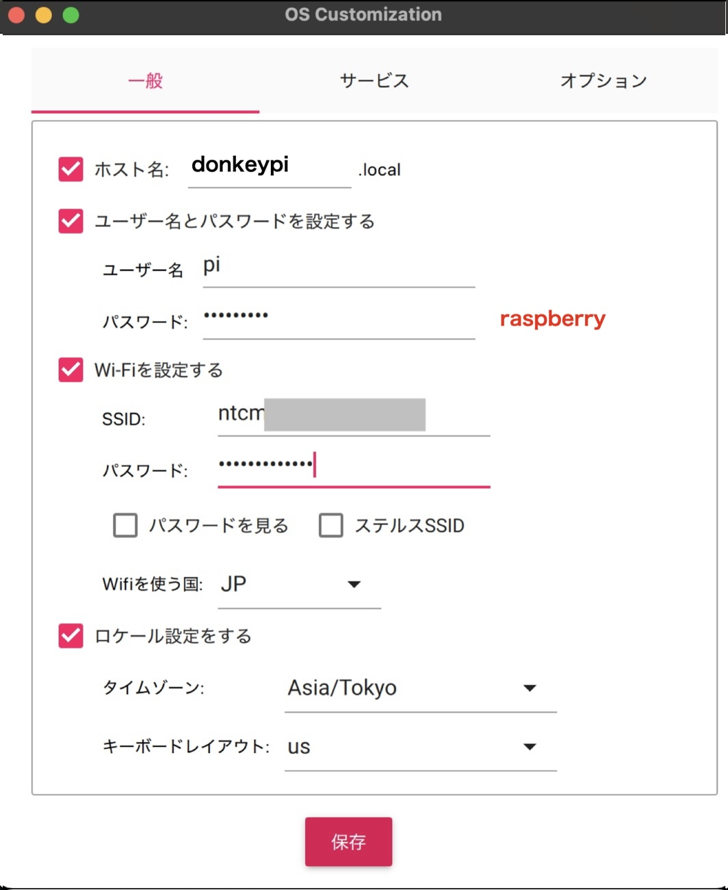

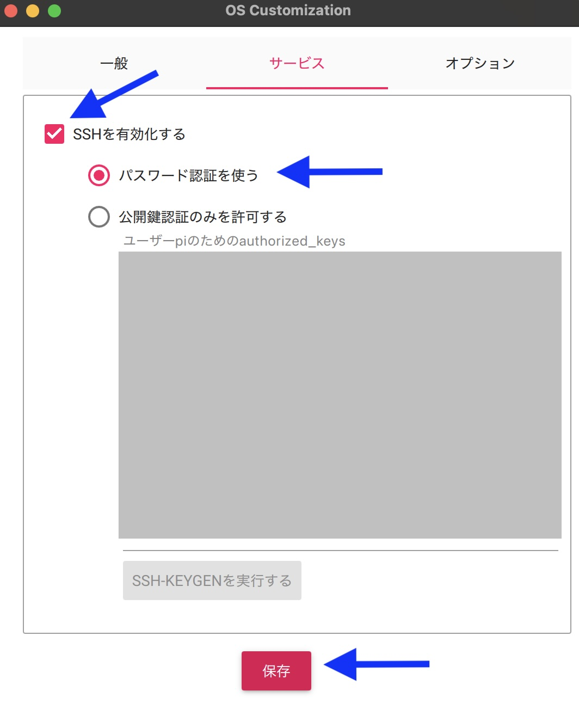

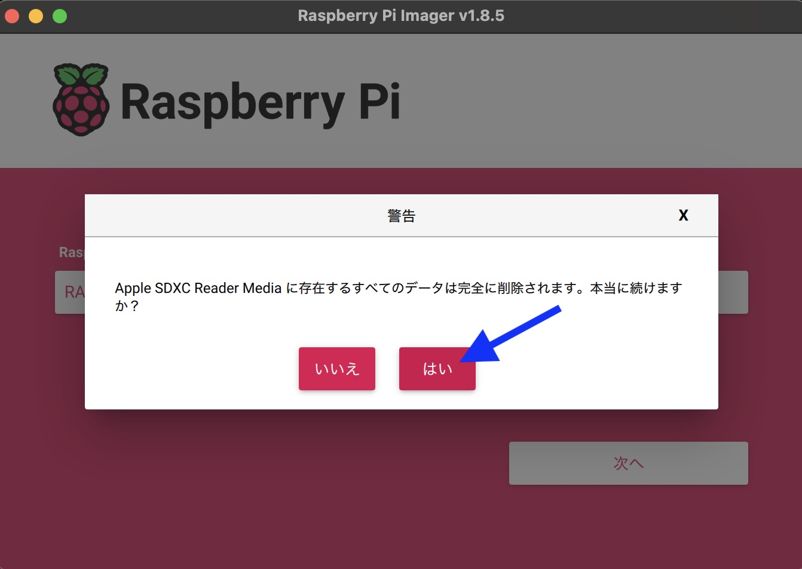

