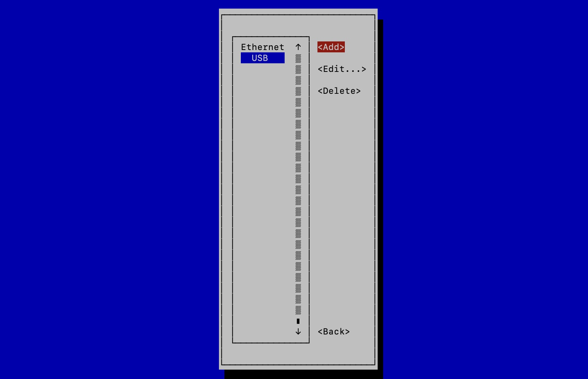

# WiFiへの接続

## RaspPiとPCを接続

RaspPiとPCをUSB Type-Cケーブルで接続します。RaspPiに電源が入り基板のOLEDのusb0にUSBのIPアドレスが割り振られます。

## SSHでログイン

Mac

```
ssh pi@donkeypi.local
```

Windoss

```
ssh pi@usb0に表示されているIPアドレス
```

## WiFiの設定

```
sudo nmtui
```





## WiFi接続の確認

```
ifconfig -a
```

OLEDのwlan0にWiFiのIPアドレスが表示されていれば、接続成功です。

