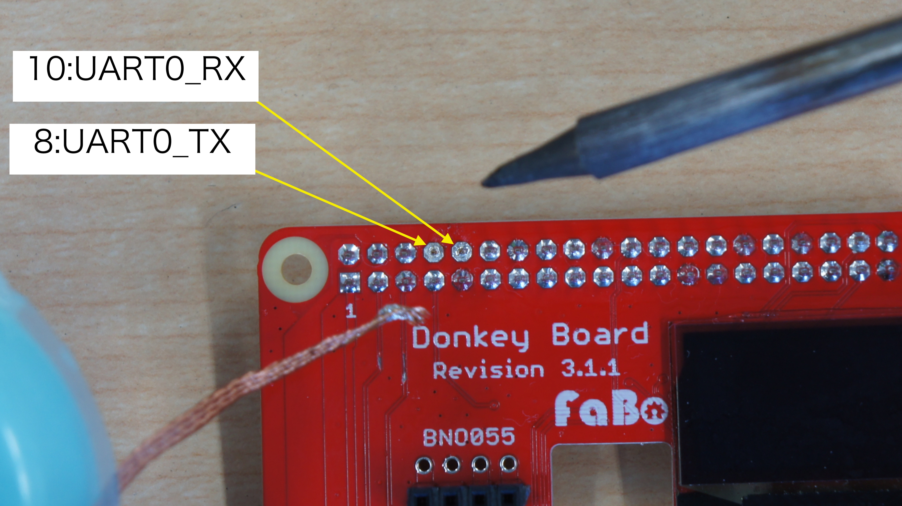
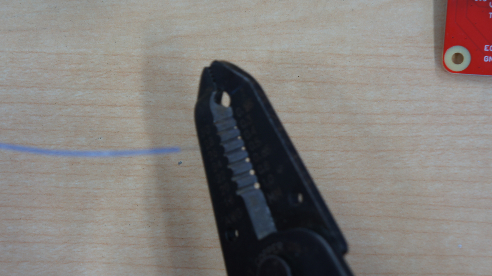

# Raspberry Pi用AI Car Board　DKFA-05

### コード番号:DKFA-05

### Revision 3.1.1
### Revision 3.1.0

## 外観

表

{: width="300px"}

裏

{: width="300px"}

{: width="1100px"}

{: width="1100px"}

※ピン番号は物理ピン番号になります。

## 特徴

本ボード搭載のPCA9685がESCやサーボを制御するためのPWM信号に変換し、より安定した信号を出力します。<br>
最大8個の超音波センサー(HC-SR04)との接続をわかりやすくかつ確実なものとします。<br>
有機ディスプレイによるRaspberry PiのIPアドレスなどの情報を表示<br>
I2Cバス拡張コネクタ付き<br>
フュージョンセンサーモジュール（BNO055）*が簡単に拡張できます。（別売）<br>
*細いピンヘッダご使用の場合は、細ピン対応のピンソケットをご使用ください（別売）<br>

!!! warning "注意"
    超音波距離センサーとの接続は適切なケーブル長さがある市販のものをお使いください。
    コネクタのピンの変形を防ぐため、力まずなるべく垂直に接続して下さい。接点不良の原因となります。
    
## 使用できるRaspberry Pi

|対象ボード||
|:--:|:--:|
|Raspberry Pi 3B＋|対応|
|Raspberry Pi ４|対応|
|Raspberry Pi 5|ーーーー|

## 回路図


<span style="font-size: 70%; color: red;">画像をダウンロードしてください。</span>

## 実装図

### 表


### 裏


## DKFA-05　BOM

| Quantity | Reference        | Name                              | Model                                      | Vender                  |
|-----|--------------|-------------------------------------|---------------------------------------------|---------------------------------|
| 4   | C1,6,7,8     | セラミックコンデンサ　10uF 0603 X5R|  |  |
| 4   | C2,3,4,5     | セラミックコンデンサ　1uF  0603 Y5V|  |  |
| 1   | CON1         | 40pin (2×20) ピンソケット| FH-2x20SG | 秋月電子通商|
| 1   | CON3         | JST PA 2mm 4pin コネクタ| S04B-PASK-2 (LF)(SN) | 日本圧着端子製造      |
| 1   | D1           | 小信号汎用ダイオード 100V 2A| 1N4148W | Diodes Incorporated |
| 1   | FAN          | 2.54mm ピッチピンヘッダ 各1列１極 (赤、黒) |   |    |
| 8   | HC1~8        | 2.54mm ピッチピンヘッダ １列8極 (赤、白、黄色、黒) |   |   |
| 1   | IC1          | 16チャンネル, 12ビット PWM Fm+ I2CバスLEDコントローラー| PCA9685PW | NXP |
| 1   | JP1          | 2mm ピッチピンヘッダ3列 １列３極 及び 2mmジャンパーピン１個 |  |秋月電子通商 |
| 3   | PWM0,1       | 2.54mm ピッチピンヘッダ １列２極（白、赤、黒） |  |   |
| 1   | R3           | DNP| |
| 1   | R4           | チップ抵抗　390K 5% 0.1W 0603|  |  |
| 1   | R5           | チップ抵抗　10K 5% 0.1W 0603 |   |  |
| 1   | R6           | チップ抵抗　100 5% 0.1W 0603 |   |  |
| 10  | R1,2,7,9,11,13,15,17,19,21 |チップ抵抗　 220 5% 0.1W 0603|  |  |
| 8   | R8,10,12,14,16,18,20,22    |チップ抵抗　 470 5% 0.1W 0603|   |  |
| 1   | U2           | 30 Pin 0.5mm Pitch Top Contact ZIF Connector,FPC Connector| ER-CON30HT-1 |buydisplay |
| 1   | DISPLAY      | 128x64ドット0.96インチ青色OLEDディスプレイ| Blue 128x64 0.96" OLED Display w/Top Contact Connector FPC, SSD1306 |buydisplay |
| 2   | BNO055      | 分割ロングピンソケット(細ピン用)　１列８極| FH2.54-40U1GF8.5-0.5 | 秋月電子通商|

※BNO055なしモデルは、分割ロングピンソケット(細ピン用)　１列８極を付属しません。
※予告なく仕様が変更されることがございます。


## BNO055接続 I2Cからシリアルに変更

 BNO055をI2C接続からシリアル接続に変更するとより安定した値が得られます。

AWG30の単線かより線の線材とAWG30があるストリッパーを用意します。


半田吸い取りなどで、BNO055モジュールはJ５をオープンにしてJ3とJ4とショートにします。

※I2C出力はJ4,J5をショート


黄色い丸ところで、I2Cの線を切断します。


カッターナイフでI2Cの通信線のみ切断します。


物理ピン８番、物理ピン１０番を半田吸い取り線で取り除きます。



ストリッパーで１cmほど剥きます。



配線をピンセット等でピンを巻き込んで半田します。

それぞれのスルーホールに半出します。

ラズパイ側８ピン TX<-->BNO055モジュール 4ピン　SCL（RX）

ラズパイ側１０ピン RX<-->BNO055モジュール　３ピン　SDA（TX）


モジュールを装着しずれて挿入していないか確認します。


確認ができましたら、ラズパイの電源を入れます。

```
sudo raspi-config
```

３番のInterface Optionsを選択します。


I6を選択します。


Noを選択します。


Yesを選択します。


再起動します。

```
sudo reboot
```

BNO055の制御ライブラリをインストールします。

```
pip3 install adafruit-circuitpython-bno055
```

使用可能なシリアルポートを調べる。

```
ls /dev/tty*
```

```
ls /dev/serial*
```
## シリアル接続サンプルコード

オイラー角を確認するコードです。

```python
# SPDX-License-Identifier: MIT
# Copyright (c) 2017 Adafruit Industries
#
# This software is provided "as is", without warranty of any kind.
# See the MIT License for details: https://opensource.org/licenses/MIT
import time
import serial
import adafruit_bno055

def initialize_sensor(port="/dev/serial0", baudrate=115200, retries=5):
    for attempt in range(1, retries + 1):
        try:
            uart = serial.Serial(port, baudrate=baudrate, timeout=5, writeTimeout=5)
            sensor = adafruit_bno055.BNO055_UART(uart)
            return sensor
        except RuntimeError as e:
            if "UART write error: 7" in str(e):
                print(f"Initialization attempt {attempt} failed with BUS_OVER_RUN_ERROR. Retrying...")
                time.sleep(0.5)  # 少し待機して再試行
            else:
                raise
    raise RuntimeError("Exceeded maximum retries for sensor initialization.")

sensor = initialize_sensor(port="/dev/serial0")
print("Sensor initialized successfully.")

while True:
    try:
        euler = sensor.euler  # (heading, roll, pitch)
        print("Euler angles:", euler)
    except RuntimeError as e:
        if "UART" in str(e):
            print("UART error during sensor read:", e)
            time.sleep(0.1)
            continue
        else:
            raise
    time.sleep(0.001)

```

## リセット回路を使う

BNO055のリセットを使用するのには本基板裏面のR3を0Ω抵抗を実装するか金属ピンなどで半田してショートさせます。（デフォルトR3はオープン）


```python
# SPDX-License-Identifier: MIT
# Copyright (c) 2017 Adafruit Industries
#
# This software is provided "as is", without warranty of any kind.
# See the MIT License for details: https://opensource.org/licenses/MIT
import time
import board
import digitalio
import serial
import adafruit_bno055

# ----- センサーリセット用関数（GPIO4を使用） -----
def sensor_reset():
    # GPIO4 (board.D4) をリセットピンとして設定
    rst = digitalio.DigitalInOut(board.D4)
    rst.direction = digitalio.Direction.OUTPUT
    # リセットパルスを発行：Low 10ms → Highに戻し、その後2秒待機
    rst.value = False
    time.sleep(0.01)  # 10ms Low
    rst.value = True
    time.sleep(2)     # センサー起動待機（2秒）
    return

# ----- センサー初期化用関数（UART経由、再試行付き） -----
def initialize_sensor(port="/dev/serial0", baudrate=57600, retries=5):
    for attempt in range(1, retries + 1):
        try:
            # UARTポートを初期化
            uart = serial.Serial(port, baudrate=baudrate, timeout=5, writeTimeout=5)
            # BNO055をUART経由で初期化
            sensor = adafruit_bno055.BNO055_UART(uart)
            return sensor
        except RuntimeError as e:
            if "UART write error: 7" in str(e):
                print(f"初期化試行 {attempt} 回目でエラー発生: {e}")
                print("1秒待機して再試行します…")
                time.sleep(1)
            else:
                raise
    raise RuntimeError("センサー初期化の再試行回数を超えました。")

# ----- メイン処理 -----
# 1. センサーリセット（GPIO4でハードウェアリセット）
sensor_reset()

# 2. UART経由でセンサーを初期化（再試行付き）
try:
    sensor = initialize_sensor(port="/dev/serial0", baudrate=57600, retries=5)
except RuntimeError as err:
    print("センサー初期化に失敗しました:", err)
    raise

# 初期化完了後、さらに1秒待機（必要に応じて調整）
time.sleep(1)
print("センサー初期化完了。")

# 3. 1秒間に100回（約10ms間隔）センサーからオイラー角を読み出すループ
print("Time(s), Heading, Roll, Pitch")
start_time = time.monotonic()
while True:
    try:
        current_time = time.monotonic() - start_time
        euler = sensor.euler
        if euler is not None:
            heading, roll, pitch = euler
        else:
            heading, roll, pitch = (None, None, None)
        print(f"{current_time:.3f}, {heading}, {roll}, {pitch}")
    except RuntimeError as e:
        print("読み出し中エラー:", e)
    time.sleep(0.01)  # 約10ms待機 → 1秒間に約100回読み出し

```